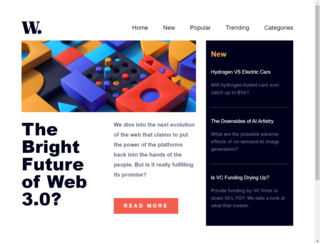
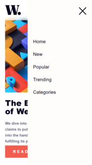
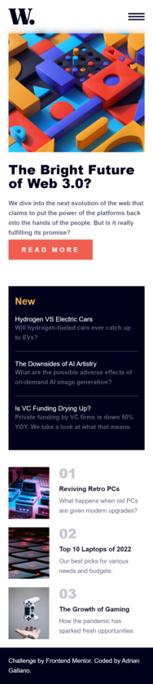

# Frontend Mentor - News homepage solution

This is a solution to the [News homepage challenge on Frontend Mentor](https://www.frontendmentor.io/challenges/news-homepage-H6SWTa1MFl). Frontend Mentor challenges help you improve your coding skills by building realistic projects. 

## Table of contents

- [Overview](#overview)
  - [The challenge](#the-challenge)
  - [Screenshot](#screenshot)
  - [Links](#links)
  - [Built with](#built-with)
- [Author](#author)

## Overview
Hello everyone, This is my first front end mentor challenge! I learned a lot including  
- Navigation bar for mobile
- how to structure my html in this case for grid websites

### The challenge

Users should be able to:

- View the optimal layout for the interface depending on their device's screen size
- See hover and focus states for all interactive elements on the page

### Screenshot

### Links

- Solution URL: [Solution](https://github.com/AdrianGallano/news-homepage)
- Live Site URL: [Live Url](https://adriangallano.github.io/news-homepage/)

### Built with

- Semantic HTML5 markup
- CSS custom properties
- Flexbox
- CSS Grid
- Mobile-first workflow

## Author

- Github - [AdrianGallano](https://www.your-site.com)
- Frontend Mentor - [@AdrianGallano](https://www.frontendmentor.io/profile/AdrianGallano)
- Twitter - [@AdrianGallano6](https://www.twitter.com/AdrianGallano6)

